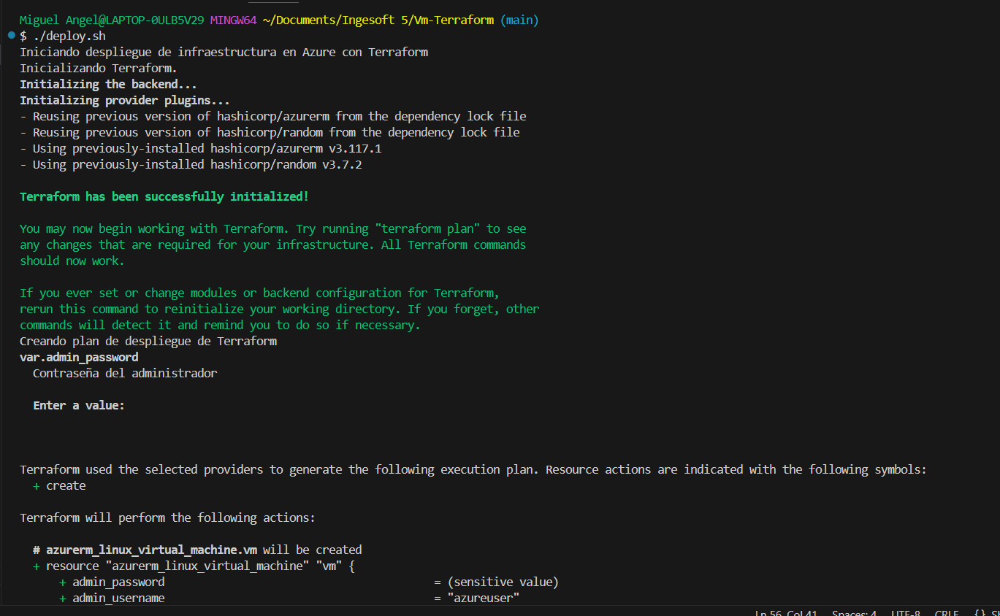
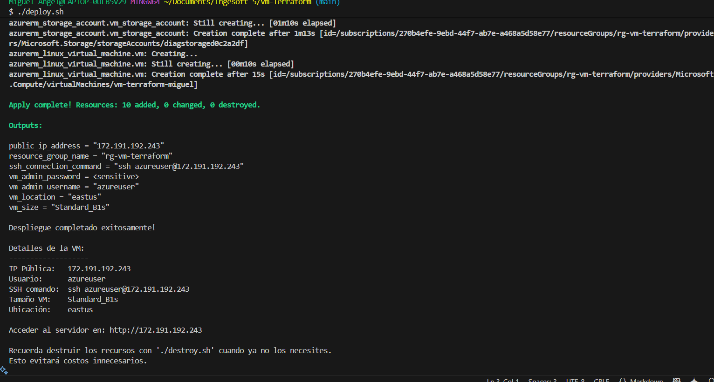
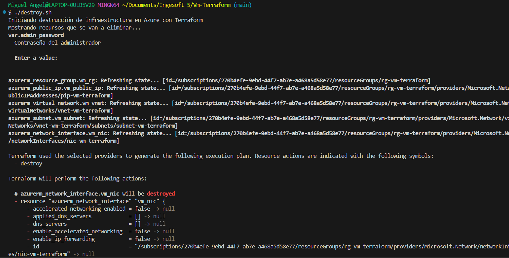
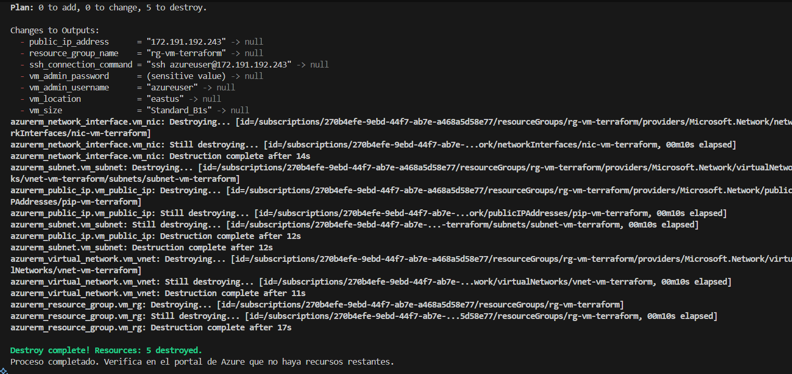
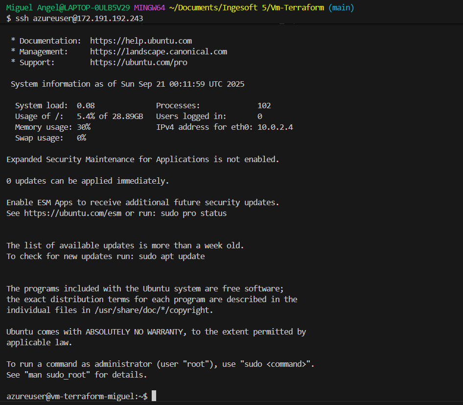

# VM Terraform - Azure

This project deploys a cost-effective virtual machine on Azure using Terraform with automated configuration through cloud-init.

## Features

- **VM Size**: Standard_B1s (most economical)
- **OS**: Ubuntu 20.04 LTS
- **Username**: azureuser
- **Password**: Terra2323
- **Access**: SSH enabled with password authentication
- **Open ports**: 22 (SSH), 80 (HTTP), 443 (HTTPS)
- **Pre-installed software**: Nginx, htop, curl, wget, git, unzip
- **Web server**: Nginx with custom welcome page

## Prerequisites

- Azure CLI installed and configured
- Terraform installed (version 1.13.1 or higher)
- Active Azure subscription

## Configuration

Your subscription ID is already configured in the state file. The project uses:
- **Resource Group**: rg-vm-terraform
- **Location**: East US
- **Virtual Network**: 10.0.0.0/16
- **Subnet**: 10.0.2.0/24

## Deployment





### Initialize Terraform:
```bash
terraform init
```

### Plan the deployment:
```bash
terraform plan
```

### Apply the configuration:
```bash
terraform apply
```

### Get the public IP:
```bash
terraform output public_ip_address
```

## Bash Scripts

You can automate with the included scripts:

### Make scripts executable:
```bash
chmod +x ./deploy.sh ./destroy.sh
```

### Deploy with script:
```bash
./deploy.sh
```

### Destroy resources with script:
```bash
./destroy.sh
```






## Connect to the VM




### SSH (Linux/macOS/Windows with WSL)
```bash
ssh azureuser@<PUBLIC_IP>
```

### PuTTY (Windows)
- **Host**: PUBLIC_IP
- **Port**: 22
- **Username**: azureuser
- **Password**: Terra2323

## Web Access

Once deployed, you can access the web server at:
```
http://<PUBLIC_IP>
```


## Current Infrastructure

Based on the Terraform state, your infrastructure includes:

- **Resource Group**: rg-vm-terraform
- **Virtual Machine**: vm-terraform-miguel
- **Network Interface**: nic-vm-terraform (MAC: 7C-1E-52-00-1F-3D)
- **Public IP**: pip-vm-terraform (172.191.192.243)
- **Virtual Network**: vnet-vm-terraform
- **Subnet**: subnet-vm-terraform
- **Private IP**: 10.0.2.4

## Estimated Costs

The Standard_B1s VM costs approximately:
- **$7.30 USD/month** in East US
- **$0.0104 USD/hour**

## Included Services

- ✅ Nginx web server (accessible at http://PUBLIC_IP)
- ✅ Basic tools: htop, curl, wget, git, unzip
- ✅ Configured firewall (UFW) with rules for SSH, HTTP, HTTPS
- ✅ Automatic package updates
- ✅ Custom welcome page with system information

## Destroy Resources

To remove all resources and avoid charges:

```bash
terraform destroy
```

## Project Files

- **[main.tf](main.tf)**: Main resource configuration
- **[variables.tf](variables.tf)**: Configuration variables
- **[outputs.tf](outputs.tf)**: Deployment outputs
- **[cloud-init.txt](cloud-init.txt)**: VM initialization script
- **[deploy.sh](deploy.sh)**: Automated deployment script
- **[destroy.sh](destroy.sh)**: Script to destroy resources
- **[.terraform.lock.hcl](.terraform.lock.hcl)**: Provider version locks

## Cloud-Init Configuration

The [cloud-init.txt](cloud-init.txt) file automatically configures:

1. **Package installation**: Updates system and installs required packages
2. **User setup**: Creates azureuser with sudo privileges
3. **SSH configuration**: Enables password authentication
4. **Firewall setup**: Configures UFW with appropriate rules
5. **Web server**: Installs and starts Nginx with custom index page
6. **Security**: Sets up proper SSH configuration

## Security

⚠️ **IMPORTANT**: This configuration is for testing purposes. For production:

- Change the default password (Terra2323)
- Use SSH keys instead of passwords
- Restrict access by IP ranges
- Use Azure Key Vault for secrets management
- Enable network security groups with stricter rules
- Consider using Azure Bastion for secure access

## Troubleshooting

### SSH Connection Issues
1. Verify the VM is running in Azure portal
2. Check if the public IP is accessible: `ping <PUBLIC_IP>`
3. Ensure port 22 is open in network security groups

### Web Server Issues
1. SSH into the VM and check Nginx status: `sudo systemctl status nginx`
2. Verify firewall rules: `sudo ufw status`
3. Check if port 80 is accessible: `curl http://<PUBLIC_IP>`